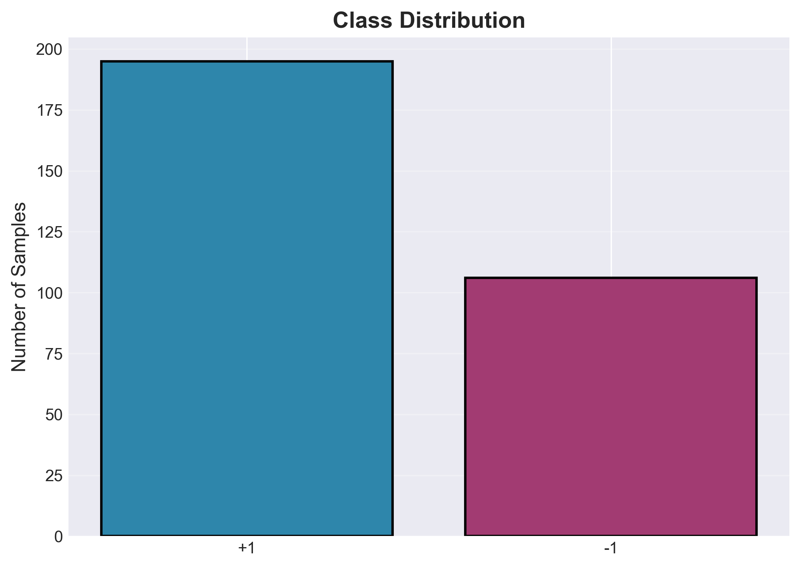
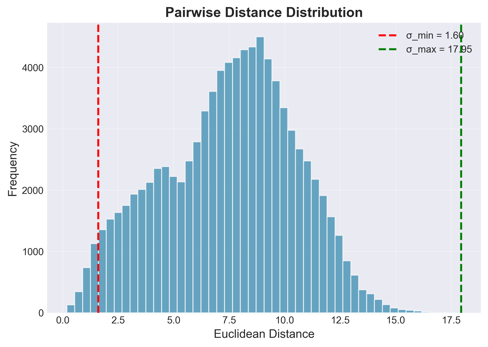
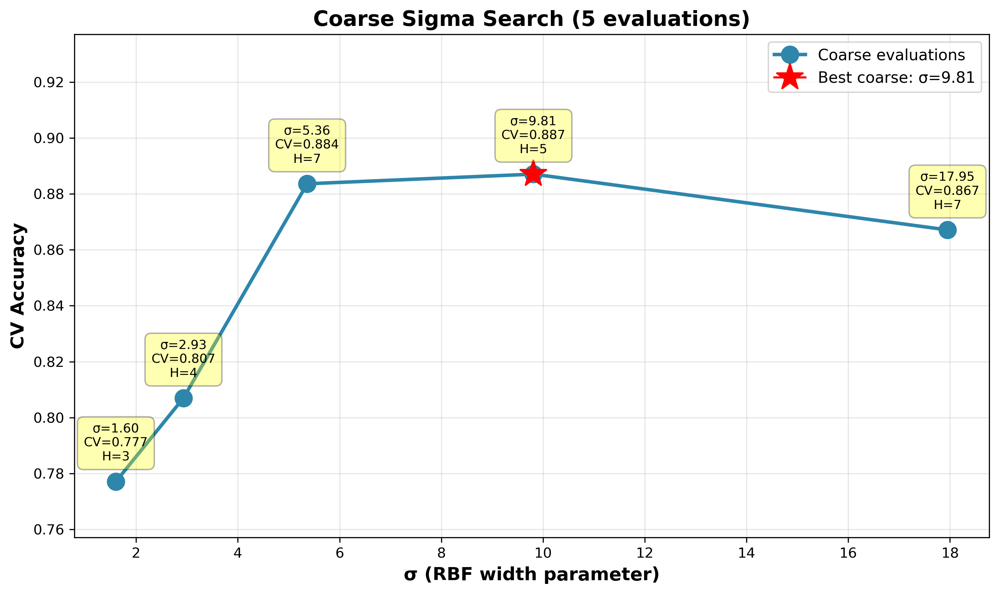
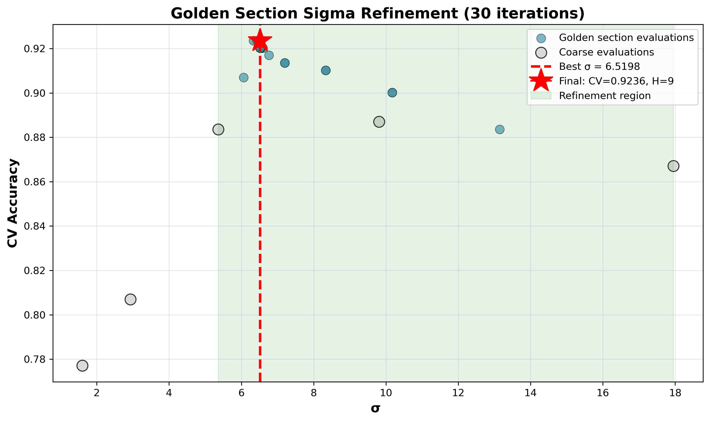
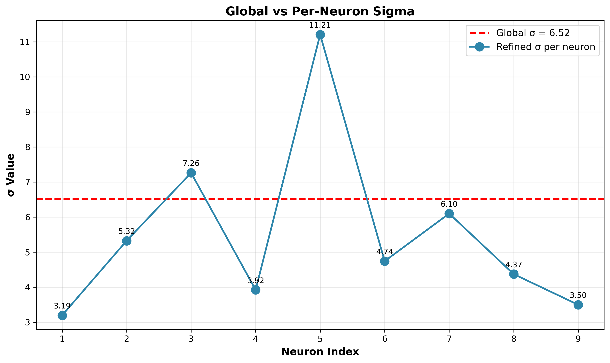
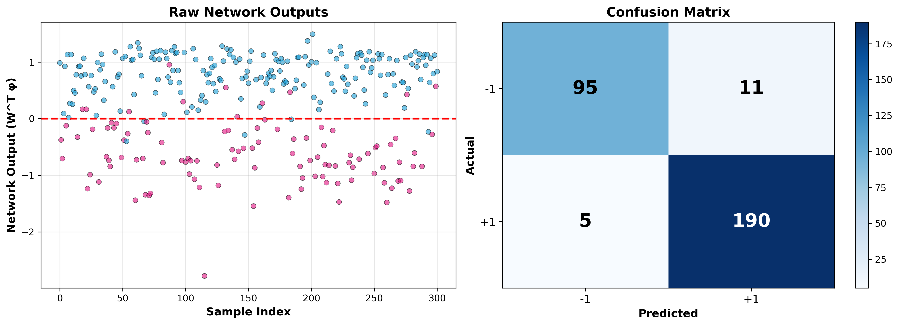
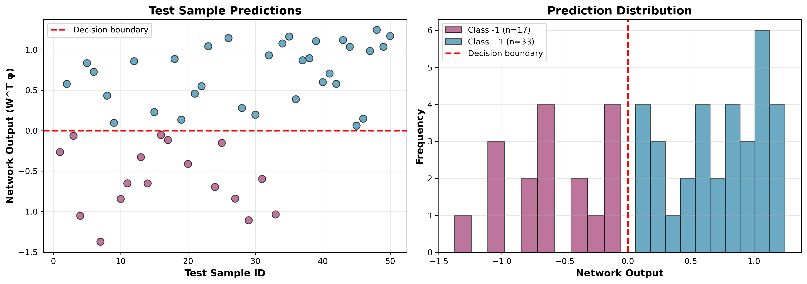

# RBF Neural Network with Intelligent Center Selection

A fully data-driven **Radial Basis Function (RBF) neural network** for binary classification.  
All architectural components — number of neurons, centers, and RBF widths — are determined automatically from data.

---

## Overview

This implementation features:

- Automatic neuron selection using **mRMR**
- Global sigma optimization via **Golden Section Search**
- Adaptive per-neuron sigma refinement
- Regularized closed-form least squares output layer
- Balanced high performance across both classes

---

## Dataset

| Split    | Samples | Features | Classes |
|----------|---------|----------|----------|
| Training | 301     | 33       | +1 / -1 |
| Test     | 50      | 33       | Unknown |

Training class distribution:
- +1 → 195 samples (64.8%)
- -1 → 106 samples (35.2%)

### Class Distribution


### Pairwise Distance Distribution


---

# Methodology

## 1. Global Sigma Optimization

Sigma search performed in two stages:

- Coarse search across feasible range
- 30-iteration Golden Section Search refinement
- 65 total sigma evaluations
- Best CV accuracy: **92.36%**
- Optimal sigma: **6.5198**

### Coarse Search


### Golden Section Refinement


---

## 2. Center Selection via mRMR

All 301 training samples were evaluated as potential RBF centers.

Discriminability score:

J = SB / SW

mRMR selection criterion:

mRMR_j = J_j − (1 / |S|) × Σ |corr(j, s)|

Process:
1. Rank candidates by J
2. Select highest mRMR
3. Validate via cross-validation
4. Stop when performance drops

Final selected neurons: **9**

Centers (training indices):

```
[79, 129, 201, 62, 115, 192, 89, 291, 300]
```

---

## 3. Adaptive Sigma Refinement

Each neuron receives its own sigma:

sigma_j = mean(distance to P=2 nearest selected centers)

Dense regions → small sigma  
Sparse regions → large sigma  

Sigma range after refinement:

3.19 – 11.21 (3.5× variation)

### Sigma Refinement


---

## 4. Final Network Architecture

| Component | Value |
|------------|--------|
| Input Dimension | 33 |
| Hidden Neurons | 9 |
| Output Units | 1 |
| Total Parameters | 315 |
| Global Sigma | 6.5198 |

Structure:

Input (33) → RBF Layer (9 neurons) → Linear Output → Class (+1 / -1)

---

## 5. Output Layer (Regularized Least Squares)

Closed-form solution:

W = (Phiᵀ Phi + lambda I)⁻¹ Phiᵀ y

Where:
- lambda = 1e-6
- Phi ∈ R^(301×9)

Classification rule:

output = Wᵀ phi(x)  
class = +1 if output ≥ 0 else −1  

---

# Results

## Training Performance

**Training Accuracy:** 94.68% (285 / 301)  
**Cross-Validation Accuracy:** 92.36%

### Training Output & Confusion Matrix


Confusion Matrix:

```
               Predicted
            -1        +1
Actual -1    98         8
Actual +1     8       187
```

Class-wise accuracy:

| Class | Accuracy |
|--------|-----------|
| -1     | 92.45% |
| +1     | 95.90% |

Balanced errors (8 FP, 8 FN).  
Low overfitting (2.3% gap between CV and training).

---

## Test Predictions

Predictions saved to:

```
data/test_predictions.csv
```

Columns:

| Column | Description |
|----------|-------------|
| Sample_ID | Test index |
| Raw_Output | Continuous output |
| Predicted_Class | +1 or -1 |
| Confidence | Confidence percentage |

Confidence definition:

- If |Raw_Output| ≥ 1 → 100%
- Else → |Raw_Output| × 100

### Test Prediction Distribution


---

# Key Insights

- 9 neurons selected from 301 candidates
- Adaptive sigma ∈ [3.19, 11.21]
- 94.68% training accuracy
- 92.36% cross-validation accuracy
- Fully automated architecture determination
- No redundant neurons (all weights significant)

---

# Installation

```
pip install numpy scipy scikit-learn pandas matplotlib openpyxl
```

---

# Project Structure

```
project/
│
├── data/
│   ├── data_train.mat
│   ├── label_train.mat
│   ├── data_test.mat
│   └── test_predictions.csv
│
├── src/
│   └── rbf_network.py
│
├── notebooks/
│   ├── 01_data_exploration.ipynb
│   ├── 02_sigma_search.ipynb
│   ├── 03_training.ipynb
│   └── 04_test_classification.ipynb
│
└── plots/
│   ├── 01_class_distribution.png
│   ├── 01_distance_distribution.png
│   ├── sigma_coarse_search.png
│   ├── golden_section_refinement.png
│   ├── sigma_refinement.png
│   ├── training_performance.png
│   └── test_predictions.png
```

---

# References

- Broomhead & Lowe (1988) — Radial Basis Function Networks  
- Peng et al. (2005) — mRMR Feature Selection  
- Kiefer (1953) — Golden Section Search  
- Chen et al. (1991) — Orthogonal Least Squares  

---
